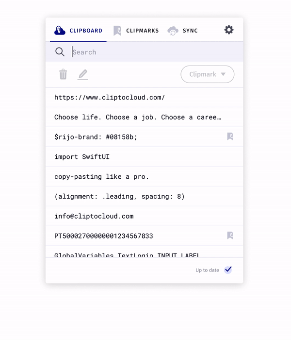

# ClipToCloud
### Power up your clipboard and start copy-pasting like a pro

 

  

## iOS Downloads

## macOS Downloads

 

## Beta

Check the new features <a href="https://github.com/Mteixeira88/Clip-To-Cloud/releases/tag/1.3-Beta-1">here.</a>

## What is ClipTocloud

ClipToCloud is a software that allows you to store all your copies in a customised clipboard all around your iOS devices. You only need to use the normal ⌘+C shortcut on your laptop and you can access to it on all your iOS devices.

### Yes, It’s all about Cmd+C’s.

You work fast. We know it. You copy-paste, fire clicks and double clicks, move information around, use shortcuts, travel from browsers to apps and round again.

What we propose is to power-up your clipboard and work even faster. With less app switching and efortless access to all those important Cmd-C’s you did.

## What you get?
* No account required
* Store up to 200 copies
* Manage all your clips in one place
* Unlimited folders and clipmarks
* Organize Relevant Clips in Folders
* Easy acccess to your clip history (cmd+shift+V)
* Easy sync. Unlimited devices.

## Security
* End to end encryption
* Sync all your devices safely
* All your clips are encrypted
* Accept and revoke your devices

## We take security seriously

### End to End Encryption

Privacy and security is in our DNA, which is why we have end-to-end encryption. When end-to-end encrypted, all your copies, folders and clipmarks are secured from falling into the wrong hands.

### How we do it?

Everytime you add a clip your clipboard, it will instantly be stored in your cloud, meaning we store all your clips with a Advanced Encryption Standard (AES) key that is stored in your main device, meaning, the device that is sharing the clipboard.

### What is Advanced Encryption Standard (AES) encryption?

When it comes to cyber security, AES is one of those acronyms that you see popping up everywhere. That’s because it has become the global standard of encryption and it is used to keep a significant amount of our communications safe.

The Advanced Encryption Standard (AES) is a fast and secure form of encryption that keeps prying eyes away from our data. We see it in messaging apps like WhatsApp and Signal, programs like VeraCrypt and WinZip, in a range of hardware and a variety of other technologies that we use all of the time.

More info about AES [here.](https://www.comparitech.com/blog/information-security/what-is-aes-encryption/)

### What about synced devices? How do you keep my clips safe?

When you accept a device on your main device, the devices will communicate with a private and secure connection where the encryption key is transmitted between them.

#### But wait, if the encryption key is transmitted, even using a private and secure connection, can't someone hack the system and get my encryption key?

No! When the main device shares the encryption key, shares it encrypted.

#### But how will the synced device decrypt the clips if the encryption key in encrypted?

The encryption key used to encrypt the the main encryption is stored and rotates between 4 different ClipToCloud servers, so everytime the invited device tries to access your clipboard it will get this key and uses it to decrypt all the clips.

### Why Apple devices first?

We have to start somewhere. Apple’s operating systems  showed more security than others. But don’t despair, Android, Linux and Windows are on the pipeline.

### You always have the last word

You always have to accept the device on your main device to make sure it was you who request access to your clipboard.

## Features

### Never Lose a Clip

### Organize Relevant Clips in Folders

Store passwords, emails, poetry in folders and keep your house clean.

### Quick Access, Quick Paste

Use a custom shortcut to access all your clicks on the spot.

### One clipboard on all devices with your permission.

Easy sync. Unlimited devices.

You always have to accept the device on your main computer to make sure it was you who request access to your clipboard.

Revoke the device whenever you want.

Remember, you always have the last word.

#### Copy Once, Paste Everywhere

Copy and paste clips at work, at home, and on the go.

### A Great User Experience

Manage all your clips in a polished interface and get a *delightful*  experience.

## [Privacy Policy](https://github.com/Mteixeira88/Clip-To-Cloud/blob/master/privacy-policy.md)

## [Terms and Conditions](https://github.com/Mteixeira88/Clip-To-Cloud/blob/master/terms.md)

## Authors
**Miguel Teixeira as iOS and Backend Developer**
* <https://github.com/Mteixeira88>

**Luis Vieira as UX Designer and Web Developer**
* <https://github.com/luismmvieira>

**Emanuel Lopes as Android and Devops Developer**
* <https://github.com/emanuellopes>

**Ruben Domingues as Devops Developer**
* <https://github.com/rcdd>
